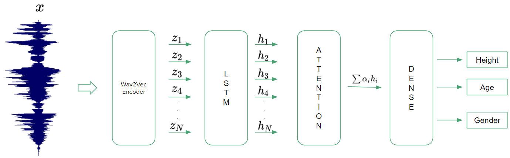

# Speaker Profiling

This Repository contains the code for estimating the Age, Height and Gender of a speaker with their speech signal. The repository experiments with both TIMIT and NISP Dataset.



## Installation

Use the package manager [pip](https://pip.pypa.io/en/stable/) to install the required packages for preparing the dataset, training and testing the model.

```bash
pip install -r requirements.txt
```

## Usage

### Download the dataset
```
# Timit Dataset
wget https://data.deepai.org/timit.zip
unzip timit.zip -d 'path to timit data folder'

# NISP Dataset
git clone https://github.com/iiscleap/NISP-Dataset.git
```

### Prepare the dataset for training and testing
```
# TIMIT Dataset
python prepare_timit_data.py --path='path to timit data folder'

# NISP Dataset
python prepare_nisp_data.pt --nisp_repo_path='path to nisp data repo folder'
```

### Training(Dev Model, to make sure everything is set as expected for training) 
```
# TIMIT Dataset
python train_timit.py --dev=True --data_path='path to final data folder'

# NISP Dataset
python train_nisp.py --dev=True --data_path='path to final data folder'
```

### Training(also check for other arguments in the train_....py file)
```
# TIMIT Dataset
python train_timit.py --data_path='path to final data folder'

# NISP Dataset
python train_nisp.py --data_path='path to final data folder'
```

### Test the Model
```
# TIMIT Dataset
python test_timit.py --data_path='path to final data folder' --model_checkpoint='path to saved model checkpoint'

# NISP Dataset
python test_nisp.py --data_path='path to final data folder' --model_checkpoint='path to saved model checkpoint'
```

## Results
### TIMIT
|        Model        	|  Height 	|  RMSE  	|  Height 	|   MAE  	|  Age 	|  RMSE  	|  Age 	|   MAE  	| Gender Acc 	|
|:-------------------:	|:-------:	|:------:	|:-------:	|:------:	|:----:	|:------:	|:----:	|:------:	|:----------:	|
|                     	|   Male  	| Female 	|   Male  	| Female 	| Male 	| Female 	| Male 	| Female 	|            	|
|       [1] 2019      	|   6.85  	|  6.29  	|    -    	|    -   	|  7.6 	|  8.63  	|   -  	|    -   	|            	|
|  [2] 2016 (fusion)  	|   **6.7**   	|   6.1  	|  **5.0**   	|   5.0  	|  7.8 	|   8.9  	|  5.5 	|   6.5  	|            	|
| [2] 2016 (baseline) 	|   7.0   	|   6.5  	|   5.3   	|   5.2  	|  8.1 	|   9.1  	|  5.7 	|   6.2  	|            	|
|       [3] 2020      	|    -    	|    -   	|    -    	|    -   	| 7.24 	|  8.12  	| 5.12 	|  **5.29**  	|    **0.996**   	|
|       [4] 2009      	|   6.8   	|   6.3  	|   5.3   	|   5.1  	|   -  	|    -   	|   -  	|    -   	|            	|
|      Our Method     	|   7.66  	|   **6.1**  	|   5.72  	|  **4.94**  	| **7.12** 	|  **7.73**  	| **5.09** 	|  5.31  	|    0.992   	|

### NISP
|    Model   	| Height 	|  RMSE  	| Height 	|   MAE  	|  Age 	|  RMSE  	|  Age 	|   MAE  	| Gender Acc 	|
|:----------:	|:------:	|:------:	|:------:	|:------:	|:----:	|:------:	|:----:	|:------:	|:----------:	|
|            	|  Male  	| Female 	|  Male  	| Female 	| Male 	| Female 	| Male 	| Female 	|            	|
|   [1] TMP  	| 6.17   	| 6.93   	| 5.22   	| 5.30   	| 5.60 	| 5.57   	| 4.40 	| 4.42   	|            	|
| [1] Comb-3 	| 6.13   	| 6.70   	| 5.16   	| 5.30   	| 5.63 	| 4.99   	| 3.80 	| 3.76   	|            	|
| Our Method 	| 6.49   	| 6.37   	| 5.32   	| 5.12   	| 5.48 	| 5.71   	| 3.70 	| 4.22   	| 0.984      	|

## Contributing
Pull requests are welcome. For major changes, please open an issue first to discuss what you would like to change.

Please make sure to update tests as appropriate.

## License
[MIT](https://choosealicense.com/licenses/mit/)
